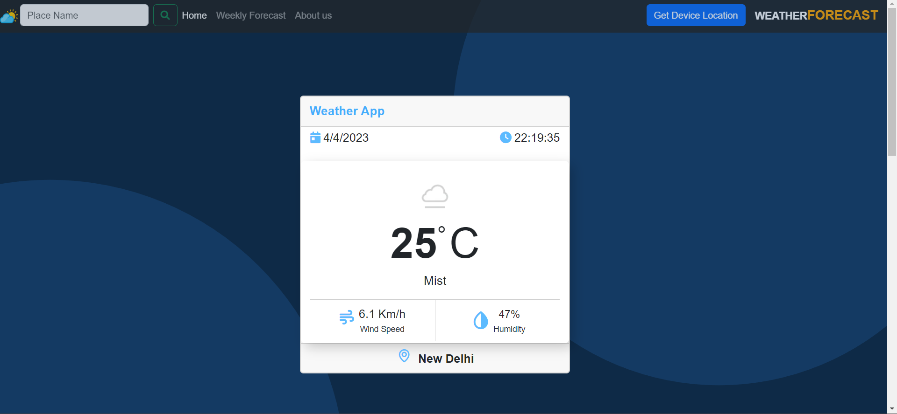
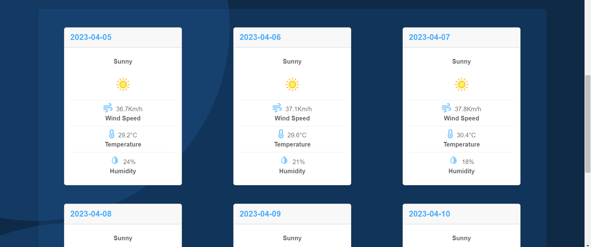

# Project - WEATHERFORECAST Web-App🌤

## Description

>This Web Application is made using HTML, CSS, BOOTSTRAP, JS and Weatherapi.
>This WeatherApp shows current weather and weekly forecast of the Place you search.
>By default it shows New Delhi's Weather. 
>In the right corner beside Logo (WeatherForecast) the BUTTON `Get Device Location` shows users current location's weather.
>You can also search your desired place's weather by entering the name of the place in the searach box.

User must give a correct and valid name of the place in search box to get the Weather otherwise it will show an error message.

>As the Free trial of weatherapi.com ended this app now shows forecast of 2 days only
